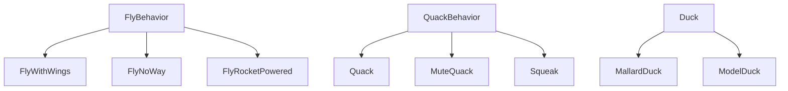

## Head First Design Pattern

- 有些人已经解决你的问题了，可以复用别人的经验

### 第一章 策略模式(Strategy Pattern)
- 在继承中，超类增加的新行为，子类都会默认使用，尽管不适用新行为的子类，也会表现出该行为。
- 当涉及维护时，为了复用目的而使用继承并不完美
- 不变的是变化
- 实现接口无法达到代码复用
- 把会变化的部分取出并封装起来，以便以后可以轻易地改动或扩充此部分，而不影响不需要变化的其他部分

- #####策略模式：定义了算法族，分别封装起来，让他们直接可以相互替换，此模式让算法的变化独立于使用算法的客户端。

### 第二章 观察者模式（Observer Pattern）

- #####观察者模式：定义了对象之间的一对多依赖，这样一来，当一个对象改变状态时，它的所有依赖者都会收到通知并自动更新
- 松耦合：让主题和观察者之间松耦合，主题只知道观察者实现了某个接口，主题不知道观察者的具体类

### 第三章 装饰者模式（decorator pattern）

- 给爱用继承的人一个全新的设计眼界
- 类应该对扩展开放，对修改关闭

- 装饰者和被装饰者对象有相同的超类型
- 可以用一个或多个装饰者包装一个对象
- 由于装饰者和被装饰者有相同的超类型，所以在任何时候需要原始对象的场合，可以用装饰果的对象代替它
- 装饰者可以在所委托被装饰者的行为之前与/或之后，加上自己的行为，以达到特定的目的
- ##### 装饰者模式：动态的将责任附加到对象上。若要扩展功能，装饰者提供比继承更有弹性的替代方案

### 第四章 工厂模式
- 简单工厂
- 抽象工厂方法 ：工厂方法用来处理对象的创建，并将这样的行为封装在子类中
	- #####工厂方法模式：定义了一个创建对象的接口，但是由子类决定要实例化的类是哪一个。工厂方法让类把实例化推迟到子类
- 依赖倒置原则
	- 不能让高层组件依赖低层组件，而且，不管高层或低层组件，都应该依赖于抽象
	- 变量不可以持有具体类的应用
	- 不能让类派生自具体类
	- 不要覆盖基类中已实现的方法
- 抽象工厂
	- #####抽象工厂模式：提供一个接口，用于创建相关或依赖对象的家族，而不需要明确指定具体类

### 第五章 单例模式（Singleton Pattern）
- ##### 单例模式：确保一个类只有一个实例，并提供一个全局访问点
- 并发的单例：
	- 如果性能对应用程序影响不是很关键，可以使用方法级别的同步
	- 也可以使用急切初始化，而不是延时初始化，当类加载时，就完成单列初始化
	- 利用双重检查加锁

### 第六章 命令模式——封装调用
- 把方法调用封装起来
- 将动作的请求者从动作的执行者对象中解耦
- 命令对象：把请求封装成一个特定对象，一个命令对象通过在特定接收者上绑定一组动作来封装一个请求
- 客户（Client），接收者（Receiver）,调用者（Invoker）,命令（Command）
- ##### 命令模式：将请求封装成对象，以便使用不同的请求、队列或日志来参数化其他对象。命令模式页支持可撤销的操作

### 第七章 适配器模式和外观模式
- #####适配器模式：将一个类的接口，转换成客户期望的另一个接口。适配器让原来接口不兼容的类可以合作无间
- 通过实现一个提供外观类，可以将一个复杂的子系统，变的容易使用
- 创建了一个简化而统一的类，用来包装子系统中一个或多个复杂类。外观模式允许我们让客户和子系统之间避免紧耦合。
- #####外观模式：提供了一个统一的接口，用来访问子系统中的一群接口。外观定义了一个高层接口，让子系统更容易使用
- 最少知识原则，减少对象之间的交互，只留下几个“密友”

### 第八章 模版方法模式

- 模版方法定义了一个算法的步骤，并允许子类为一个或多个步骤提供实现。
- ##### 模版方法模式：在一个方法中定义一个算法的骨架，而将一些步骤延迟到子类中。模版方法使得子类可以在不改变算法结构的情况下，重新定义算法中的某些步骤
- 钩子是一种被声明在抽象类中的方法，但是只有空的或者默认的实现。
- 依赖腐败：当高层组件依赖低层组件，而低层组件又依赖高层组件，而高层组件又依赖边侧组件，而边侧组件又依赖低层组件

### 第九章 迭代器和组合模式
- 如何让客户遍历你的对象而又无法窥视你存储对象的方式？
- ##### 迭代器模式：提供一种方法顺序访问一个聚合对象中的各个元素，而又不暴露其内部的表示。
- ##### 组合模式：允许你将对象组合成树形结构来表现“整体/部分”层次结构。组合能让客户以一直的方式处理个别对象以及对象组合
- 组合模式让我们能用树形方式创建对象的结构，树里面包含了组合以及个别的对象。

### OO设计原则

- 找出应用中可能需要变化之处，把它们独立，不要和那些不需要变化的代码混在一起
- 针对接口编程，而不是针对实现编程
- 多用组合，少用继承
- 为了交互对象之间的松耦合设计而努力
- 类应该对扩展开放，对修改关闭
- 要依赖抽象，不要依赖具体类
- 一个类，一个责任
- 最少知识原则：只和你的密友谈话
- 别调用我们，我们会调用你
- 一个类应该只有一个引起变化的原因
